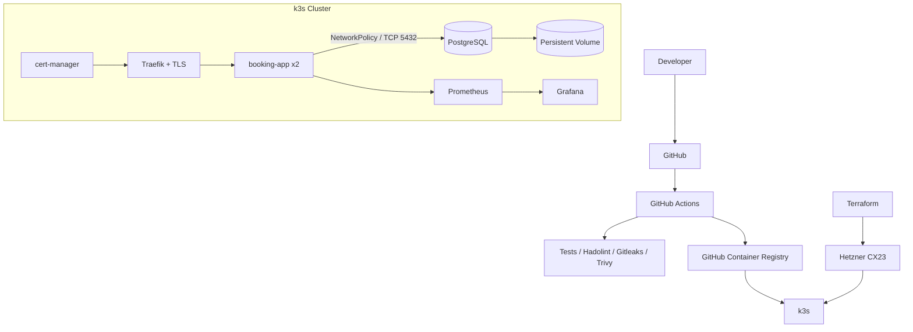
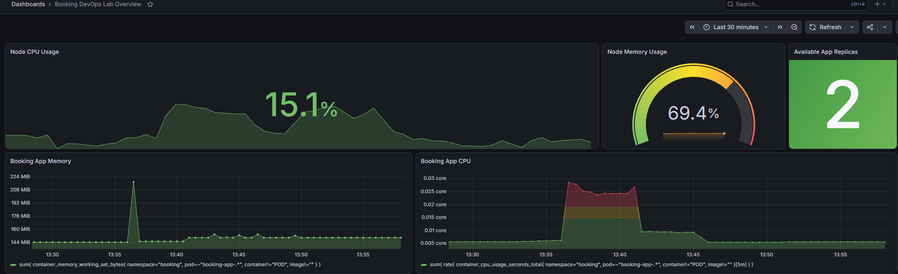
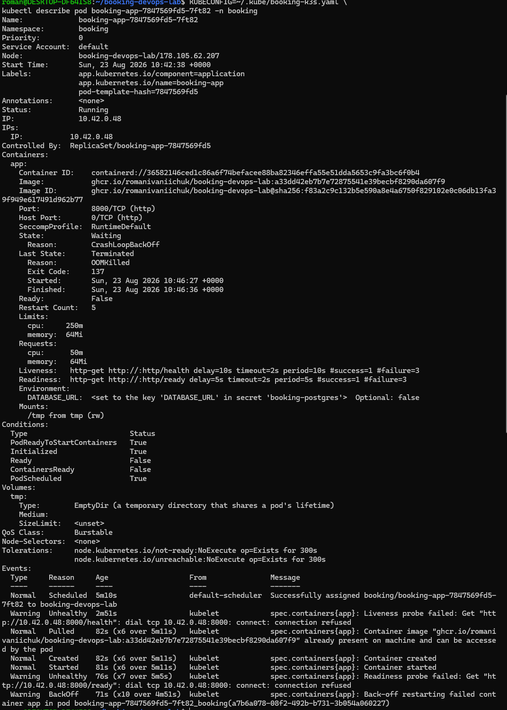
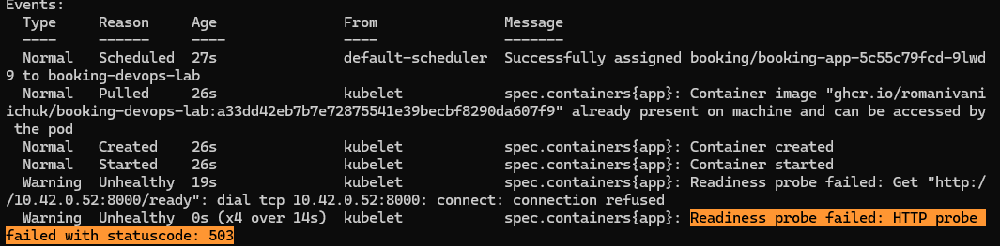
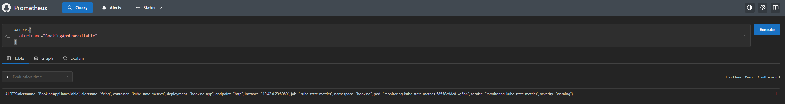

# Booking DevOps Lab

A production-style DevOps lab built around a small FastAPI booking service.

> This project is intentionally production-style, not production-ready.

The application serves as a controlled workload for practicing infrastructure as code, containerization, Kubernetes deployments, CI/CD, monitoring, alerting and incident recovery.

## What this project demonstrates

- Containerized FastAPI + PostgreSQL application
- CI pipeline with testing, linting, secret scanning and vulnerability scanning
- Terraform-managed Hetzner infrastructure
- k3s Kubernetes cluster
- Helm-based deployments
- TLS with cert-manager
- Kubernetes health probes and NetworkPolicy
- Prometheus metrics and alerting
- Grafana dashboards
- Chaos engineering and incident response

## Architecture

## Stack

- **FastAPI** — lightweight application workload
- **PostgreSQL** — persistent application database
- **Docker** — reproducible container images
- **Terraform** — infrastructure as code
- **Hetzner Cloud** — inexpensive real VPS infrastructure
- **k3s** — lightweight Kubernetes distribution
- **Helm** — repeatable Kubernetes deployments
- **Traefik** — ingress routing
- **cert-manager** — automated TLS certificate management
- **Prometheus** — infrastructure and application metrics
- **Grafana** — dashboards and observability
- **GitHub Actions** — automated CI pipeline
- **GHCR** — container image registry

## CI/CD

Every change is validated through the CI pipeline:

`push → Hadolint → Gitleaks → tests → image build → Trivy → GHCR`

Container images are tagged with the Git commit SHA, providing a direct link between deployed workloads and source code.

## Reliability and Chaos Engineering

The project includes controlled failure scenarios used to practice monitoring, diagnosis and recovery.

### OOMKilled

An intentionally undersized memory limit caused the application container to be OOMKilled. The failure was detected through Kubernetes container state metrics and the `BookingAppOOMKilled` Prometheus alert.

[Read the OOMKilled incident report](docs/incidents/01-oomkilled.md)

### Database connectivity failure

PostgreSQL ingress was intentionally blocked using a Kubernetes NetworkPolicy. Application containers remained running but became NotReady because `/ready` could no longer reach the database. Available replicas dropped to zero and triggered `BookingAppUnavailable`.

[Read the DB unavailable incident report](docs/incidents/02-db-unavailable.md)

## Why Kubernetes for a small booking app?

Kubernetes is intentionally overkill for the workload itself. The goal of this project is not to justify Kubernetes for a small booking site, but to use a simple application as a controlled workload for practicing deployments, health probes, rolling updates, NetworkPolicies, persistent storage, TLS, monitoring, alerting and incident recovery.

## Screenshots

### Monitoring

### OOMKilled incident

### Database connectivity incident

## Running locally

Clone the repository:

git clone https://github.com/romanivaniichuk/booking-devops-lab.git
cd booking-devops-lab

Create the Python environment and install dependencies:
python3 -m venv .venv
source .venv/bin/activate
pip install -r requirements.txt -r requirements-dev.txt

Run tests:
make test

Start the local environment:
make dev

## Deployment

Production-style deployment requires:

- Hetzner Cloud credentials
- Terraform
- kubectl
- Helm
- a running k3s cluster
- required Kubernetes secrets

Deployment is performed through the Makefile:

make deploy IMAGE_TAG=<git-sha> TLS_ISSUER=booking-letsencrypt-prod 

Infrastructure lifecycle is managed with Terraform.
